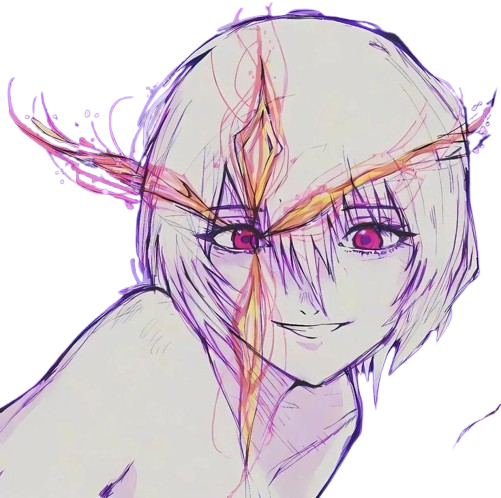
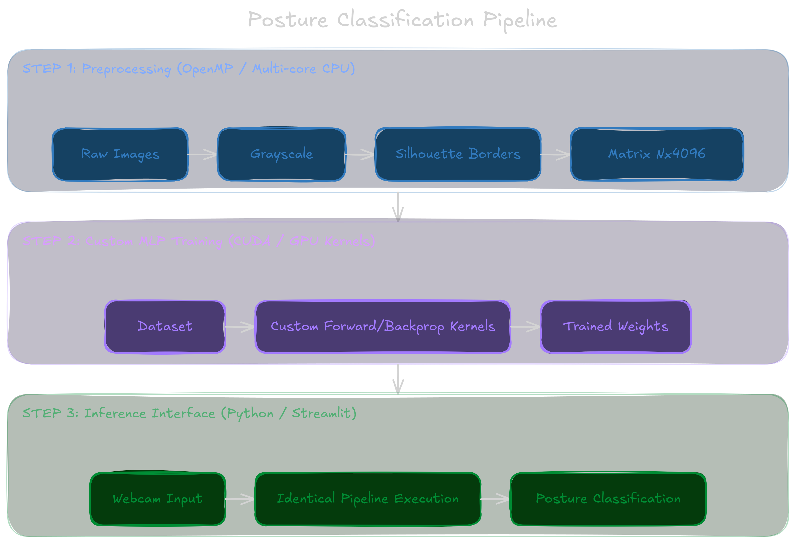

<div align="center">
  

  <h3 align="center">Computer vision for posture detection</h3>

  <p align="center">
    Hybrid CPU/GPU architecture using OpenMP and CUDA for classification from scratch
  </p>
</div>


<!-- TABLE OF CONTENTS -->
<details>
  <summary>Table of Contents</summary>
  <ol>
    <li>
      <a href="#about-the-project">About The Project</a>
      <ul>
        <li><a href="#project-context">Project Context</a></li>
        <li><a href="#pipeline-architecture">Pipeline Architecture</a></li>
        <li><a href="#built-with">Built With</a></li>
      </ul>
    </li>
    <li>
      <a href="#getting-started">Getting Started</a>
      <ul>
        <li><a href="#prerequisites">Prerequisites</a></li>
        <li><a href="#installation-and-setup">Installation and Setup</a></li>
      </ul>
    </li>
    <li>
      <a href="#usage-and-execution">Usage and Execution</a>
      <ul>
        <li><a href="#stage-1-openmp-preprocessing">Stage 1: OpenMP Preprocessing</a></li>
        <li><a href="#stage-2-cuda-training">Stage 2: CUDA Training</a></li>
        <li><a href="#stage-3-streamlit-app">Stage 3: Streamlit App</a></li>
      </ul>
    </li>
    <li><a href="#performance-report-link">Performance Report & Benchmarks</a></li>
  </ol>
</details>

<br>
 
## About The Project

### Project Context
This project implements an end-to-end image classification pipeline built from scratch to detect sitting posture (slouched vs. upright). Instead of utilizing pre-trained deep learning frameworks, the system handles the entire lifecycle: local dataset creation, multi-core CPU preprocessing, custom GPU neural network training, and real-time deployment.  

The optimization goal focuses on benchmarking parallel computing patterns, measuring speedup, and analyzing hardware utilization limits across serial and parallel executions.

### Pipeline Architecture
The system is divided into three distinct execution phases:



### Built With

<table>
  <tr>
    <td align="center" width="150">
      <br>
      
    </td>
    <td>
      Handles low-level multi-core data-parallel execution loops over the image directory.
    </td>
  </tr>
  <tr>
    <td align="center" width="150">
      
    </td>
    <td>
      Manages hardware-accelerated thread scheduling, global/shared memory allocation, and matrix execution kernels on the GPU.
    </td>
  </tr>
  <tr>
    <td align="center" width="150">
      <br>
      
    </td>
    <td>
      Runs the quick prototyping layout for user interaction and real-time inference prediction.
    </td>
  </tr>
</table>
<br>

## Getting Started

### Prerequisites
Before setting up and executing this project, ensure your system meets the following hardware and software requirements:

* **Operating System**: Linux (Ubuntu 20.04 LTS or later recommended) or Windows with WSL2 configured.
* **Compiler and Flags**: `gcc` with OpenMP support (e.g., `-fopenmp`).
* **CUDA Toolkit**: NVIDIA CUDA Toolkit (v11.0 or higher) matching your GPU driver capability.
* **Python Environment**: Python 3.8 or higher.

### Installation and Setup

1. **Clone the Repository**
   ```bash
   git clone https://github.com/Daxdzzzy/proyecto-C-postura-y-borde
   cd proyecto-C-postura-y-borde
   ```

2. **Download the Dataset**
Since the raw image files are excluded from this repository via `.gitignore` due to size and composition constraints, you must download the structured dataset manually.
* Download the dataset from the following link: https://drive.google.com/drive/folders/1osc-LFSSpwpy6_MkisDl1tH1SWocND23?usp=drive_link
* Extract the contents into the root directory of the project. Ensure the folder structure matches:

    ```text
    ├── dataset/
    │   ├── class_1_slouched/
    │   └── class_0_upright/

    ```

3. **Install Python Dependencies**
Configure the virtual environment and install the packages required for the Stage 3 graphical interface:

    ```bash
    python -m venv venv
    source venv/bin/activate  # On Windows use: venv\Scripts\activate
    pip install streamlit numpy pillow

    ```

## Usage and Execution

This project is executed in three sequential stages. You must follow this order to properly process the data, train the model, and run the interface.

### *Stage 1: Preprocessing (OpenMP)*
Processes independent image files in a parallelized loop to convert inputs into grayscale, apply silhouette edge detection filters, resize structures to $64 \times 64$ pixels, and output a flattened matrix to disk.


1. Compile the Preprocessing Script Compile the C source code using `gcc` with the OpenMP flag enabled

   ```bash
   gcc -fopenmp preprocess.c -o preprocess -lm

    ```

2. Run Execution BenchmarksTest the pipeline by changing the number of active threads to evaluate scalability and measure speedup against the baseline serial execution:

    ```bash
    # Run serial execution (1 thread)
    OMP_NUM_THREADS=1 ./preprocess

    # Run parallel execution (e.g., 2, 4, 8 threads)
    OMP_NUM_THREADS=4 ./preprocess

    ```
    This will output the flattened image matrix (`dataset.bin` or `dataset.csv`) and labels directly to disk.

### *Stage 2: Model Training (CUDA)*
Loads the flattened dataset to train a Multi-Layer Perceptron (MLP) using explicit GPU kernels for matrix multiplication, bias addition, activations (ReLU/Sigmoid), Binary Cross-Entropy loss computation, and backpropagation.

1. Compile the CUDA Training Application Compile the device kernels and host code using the NVIDIA CUDA Compiler (`nvcc`):


    ```bash
    nvcc train.cu -o train_mlp
    ```

2. Execute Model Training Run the training executable to execute the network forward pass, calculate Binary Cross-Entropy loss, compute backpropagation gradients, and optimize weights via SGD:

    ```bash
    ./train_mlp

    ```

   Upon completion, this process automatically exports the trained weight and bias matrices to an external file (e.g., `weights.bin`)

### *Stage 3: Application (Streamlit)*
A lightweight deployment application that loads the raw binaries to run inference on new webcam captures.

1. Launch the Web Interface Ensure your Python virtual environment is active and launch the Streamlit server:

```bash
streamlit run app.py
```

2. Perform Inference Open the local URL provided by Streamlit in your browser (typically `http://localhost:8501`).
* Upload an image or provide a static file to trigger the Python inference engine.


* The backend applies the identical preprocessing transformations (grayscale, Sobel edge filters, and $64 \times 64$ resizing) before running the forward pass with your saved weights to output the final posture classification.

## Performance Report & Benchmarks

For a detailed analysis of execution times, hardware specifications, speedup charts, and academic reflection questions, please refer to the [Performance Report & Benchmarks](./docs/BENCHMARK_REPORT.md).
