[← Volver al README Principal](../README.md)

# Informe de Rendimiento y Benchmarks

  

<!-- TABLA DE CONTENIDO -->

  
Tabla de Contenido

  <ol>
    <li>
      <a href="#análisis-del-conjunto-de-datos">Análisis del Conjunto de Datos</a>
      <ul>
        <li><a href="#recolección-y-variedad-de-datos">Recolección y Variedad de Datos</a></li>
        <li><a href="#división-de-los-datos">División de los Datos</a></li>
      </ul>
    </li>
    <li>
      <a href="#arquitectura-de-la-red-neuronal">Arquitectura de la Red Neuronal</a>
      <ul>
        <li><a href="#capas-y-parámetros-del-mlp">Capas y Parámetros del MLP</a></li>
      </ul>
    </li>
    <li>
      <a href="#rendimiento-etapa-1-openmp">Rendimiento Etapa 1: OpenMP</a>
      <ul>
        <li><a href="#tabla-de-tiempos-de-ejecución">Tabla de Tiempos de Ejecución</a></li>
        <li><a href="#gráfica-y-análisis-de-speedup">Gráfica y Análisis de Speedup</a></li>
        <li><a href="#preguntas-de-reflexión-de-openmp">Preguntas de Reflexión de OpenMP</a></li>
      </ul>
    </li>
    <li>
      <a href="#rendimiento-etapa-2-cuda">Rendimiento Etapa 2: CUDA</a>
      <ul>
        <li><a href="#tiempos-de-entrenamiento-cpu-vs-gpu">Tiempos de Entrenamiento CPU vs GPU</a></li>
        <li><a href="#análisis-del-impacto-del-tamaño-de-bloque">Análisis del Impacto del Tamaño de Bloque</a></li>
        <li><a href="#monitoreo-de-gpu">Monitoreo de GPU</a></li>
        <li><a href="#preguntas-de-reflexión-de-cuda">Preguntas de Reflexión de CUDA</a></li>
      </ul>
    </li>
    <li>
      <a href="#métricas-de-evaluación-del-modelo---etapa-3">Métricas de Evaluación del Modelo - Etapa 3</a>
      <ul>
        <li><a href="#curvas-de-pérdida-y-exactitud-del-entrenamiento">Curvas de Pérdida y Exactitud del Entrenamiento</a></li>
        <li><a href="#matriz-de-confusión">Matriz de Confusión</a></li>
        <li><a href="#precisión-recall-y-puntaje-f1">Precisión, Recall y Puntaje F1</a></li>
      </ul>
    </li>
    <li><a href="#conclusiones">Conclusiones</a></li>
    <li><a href="#referencias">Referencias</a></li>
  </ol>

## Análisis del Conjunto de Datos

El conjunto de datos del proyecto está diseñado para la detección binaria de postura sentada (`postura_recta` vs. `postura_encorvada`). Está balanceado adecuadamente y se divide en conjuntos de Entrenamiento, Validación y Prueba.

### Recolección y Variedad de Datos
* **Clase 0 (Postura Recta):** 716 imágenes totales en el dataset.
* **Clase 1 (Postura Encorvada):** 773 imágenes totales en el dataset.
* **Sujetos y Condiciones:** Múltiples sujetos en distintas posiciones corporales y bajo diversas condiciones de iluminación y fondos para mejorar la generalización del modelo.

### División de los Datos
La división del dataset se realizó de forma estructurada siguiendo la proporción clásica 70/15/15:

* **Entrenamiento (70%):** 1,042 imágenes (501 de Clase 0, 541 de Clase 1)
* **Validación (15%):** 223 imágenes (107 de Clase 0, 116 de Clase 1)
* **Prueba (15%):** 224 imágenes (108 de Clase 0, 116 de Clase 1)
* **Total:** 1,489 imágenes

---

## Arquitectura de la Red Neuronal

### Capas y Parámetros del MLP

La red consiste en una capa de entrada, una única capa densa oculta y una capa densa de salida. A continuación se presenta la especificación estructural y la dimensión exacta de cada capa:

**Capa de Entrada ($L_0$):** 4,096 nodos, que representan los píxeles aplanados de la imagen preprocesada de $64 \times 64$.

* **Capa Oculta ($L_1$):** Capa densa con 128 neuronas, utilizando la función de activación Rectified Linear Unit (ReLU).
* **Capa de Salida ($L_2$):** Una sola neurona con función de activación Sigmoid para mapear la probabilidad binaria ($0$ o $1$).

#### Propiedades de las Capas y Parámetros Entrenables

| Capa               | Tipo  | Tamaño de Entrada | Tamaño de Salida | Función de Activación |  Matriz de Pesos  |   Vector Bias  |          Parámetros Totales          |
| :----------------- | :---- | :---------------: | :--------------: | :-------------------: | :---------------: | :------------: | :----------------------------------: |
| **Oculta ($L_1$)** | Densa |       4,096       |        128       |          ReLU         | $4096 \times 128$ | $128 \times 1$ |    $(4096 \times 128) + 128 = 524,416$   |
| **Salida ($L_2$)** | Densa |        128        |         1        |        Sigmoid        |   $128 \times 1$  |  $1 \times 1$  |               $128 + 1 = 129$        |
| **Total**          |       |                   |                  |                       |                   |                | **524,545**                          |

> *Nota: Se utilizó un tamaño de capa oculta ($W_1$) de 128 neuronas.*

#### Cálculo Matemático de los Parámetros (Fórmula)

Para verificar el rigor intelectual y matemático de la red, los parámetros se calculan usando la fórmula: $\text{Parámetros} = (\text{entradas} \times \text{salidas}) + \text{biases}$.

* **Capa Oculta ($L_1$):** $(4,096 \times 128) + 128 = 524,416$
* **Capa de Salida ($L_2$):** $(128 \times 1) + 1 = 129$

---

## Rendimiento Etapa 1: OpenMP

### Tabla de Tiempos de Ejecución

A continuación se presentan los tiempos medidos al ejecutar el preprocesamiento sobre el conjunto completo de **entrenamiento (1,042 imágenes)** con diferentes números de hilos en OpenMP:

| Hilos | Tiempo (segundos) | Speedup Real | Eficiencia |
| :---: | :---------------: | :----------: | :--------: |
|   1   |      39.9010      |     1.00     |    1.00    |
|   2   |      21.0810      |     1.89     |    0.95    |
|   4   |      11.5700      |     3.45     |    0.86    |
|   8   |       6.6220      |     6.03     |    0.75    |
|  12   |       5.6080      |     7.12     |    0.59    |

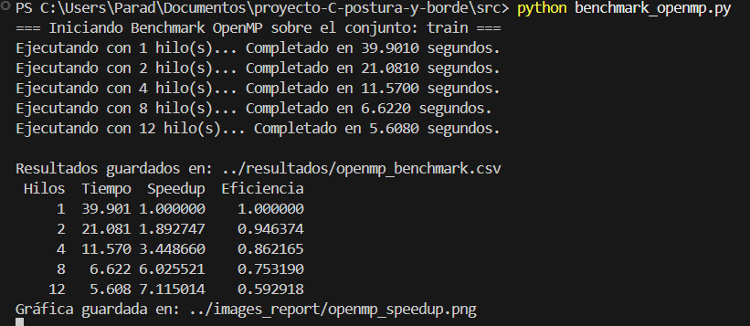

### Gráfica y Análisis de Speedup

Comparativa del comportamiento del escalado temporal y de la aceleración obtenida frente al comportamiento ideal lineal:

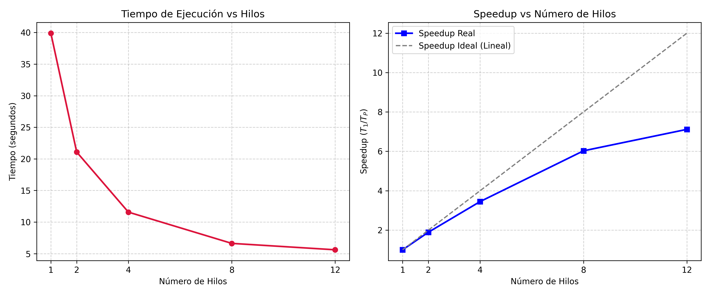

* **Análisis:** Se observa un escalado sumamente favorable hasta los 8 hilos (con una eficiencia superior al 75%). Al subir a 12 hilos, la ganancia de velocidad empieza a estabilizarse (Speedup de 7.12×), debido al cuello de botella de la lectura secuencial de disco (E/S) y al límite de núcleos físicos reales del procesador (6 núcleos reales, 12 lógicos).

### Preguntas de Reflexión de OpenMP

1. **¿Por qué este preprocesamiento es “vergonzosamente paralelo”? Den una analogía.**
   * **Respuesta:** Se considera vergonzosamente paralelo porque el preprocesamiento de cada imagen (conversión a escala de grises, redimensionamiento, aplicación del filtro Sobel) se realiza de forma completamente independiente. El resultado de procesar una imagen no depende ni afecta al procesamiento de ninguna otra.
   * **Analogía:** Imagina a un grupo de 10 profesores calificando exámenes independientes. Cada profesor puede calificar su propia pila de exámenes sin necesidad de comunicarse o sincronizarse con los otros profesores. El trabajo total simplemente se divide entre la cantidad de profesores disponibles.

2. **Si tienen 8 hilos pero el speedup se queda en 5×, ¿qué lo limita? (pista: Ley de Amdahl).**
   * **Respuesta:** La Ley de Amdahl establece que la aceleración está acotada por la fracción del código que es puramente secuencial (no paralelizable). En este pipeline, esa fracción secuencial corresponde mayoritariamente a las operaciones de Entrada y Salida (E/S) a disco: abrir, decodificar las imágenes mediante `stb_image` y, al final, la consolidación/guardado de los archivos `.bin` resultantes. Dado que la lectura y escritura física en disco es inherentemente secuencial a nivel del sistema operativo, este cuello de botella evita que la ganancia de rendimiento crezca linealmente con el número de núcleos.

3. **Diagrama del flujo de una imagen desde foto cruda hasta vector de 4,096:**
   * **Respuesta:** A continuación se ilustra el flujo conceptual de preprocesamiento de una imagen:
   
   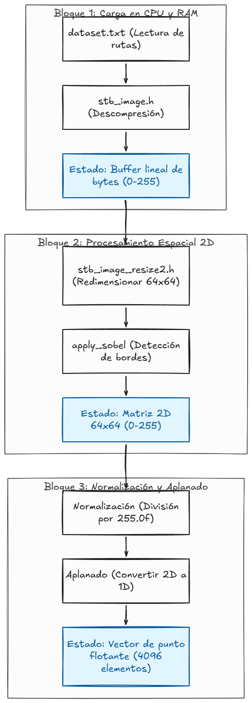

## Rendimiento Etapa 2: CUDA

### Tiempos de Entrenamiento CPU vs GPU

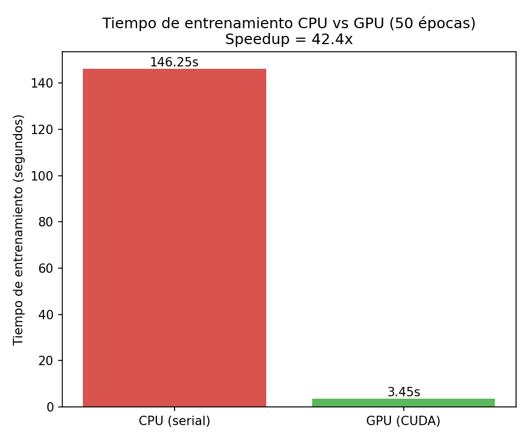

### Análisis del Impacto del Tamaño de Bloque

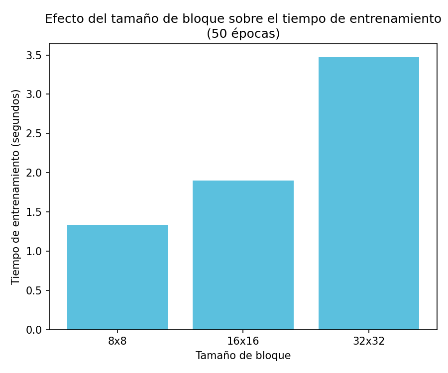

### Monitoreo de GPU

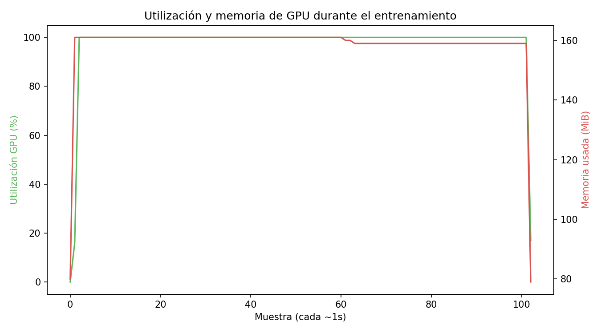

### Preguntas de Reflexión de CUDA

1. **¿Por qué la multiplicación de matrices es ideal para la GPU? ¿Cuántos hilos lanzan y qué calcula cada uno?**
   - **Idealidad para GPU:** La multiplicación de matrices ($C = A \times B$) es un problema masivamente paralelo con un alto grado de independencia de datos (paralelismo a nivel de datos). Cada elemento $C[i][j]$ de la matriz resultante se calcula de forma independiente realizando el producto punto de la fila $i$ de $A$ y la columna $j$ de $B$. Las GPUs, diseñadas bajo la arquitectura SIMT (Single Instruction, Multiple Threads), poseen miles de núcleos capaces de ejecutar la misma instrucción aritmética en paralelo sobre diferentes elementos de datos. Esto es ideal para ocultar la latencia de memoria con computación activa.
   - **Cantidad de hilos y cálculo:** Se suele lanzar una cuadrícula bidimensional de hilos (Grid of Blocks) donde el número total de hilos es igual (o superior, manejando límites) al número de elementos en la matriz resultante ($M \times N$, donde $M$ es el número de filas de $A$ y $N$ es el número de columnas de $B$). Cada hilo individual se identifica mediante sus coordenadas globales en la malla (`blockIdx` y `threadIdx`) y se encarga de calcular exactamente **un único elemento** de la matriz de salida $C[fil][col]$ realizando el bucle de acumulación (producto punto) correspondiente.

2. **Una capa densa es un matmul. Entonces, ¿qué estaba haciendo PyTorch por dentro en el corte anterior?**
   - PyTorch por debajo utiliza librerías optimizadas de álgebra lineal como **cuBLAS** (para ejecuciones en GPU de NVIDIA) o **ATen** (su librería interna de tensores).
   - En una capa densa (fully connected / lineal), realiza la operación del *Forward Pass*: $Y = X \cdot W^T + b$. PyTorch gestiona de forma transparente la asignación de memoria en la VRAM de la GPU, la transferencia de los tensores de entrada, la invocación de kernels altamente optimizados de multiplicación de matrices (que usan técnicas avanzadas como memoria compartida/shared memory y registros del chip para minimizar accesos a memoria global), y la adición del vector de sesgo (bias) de forma paralela.

3. **¿En qué punto el speedup CPU→GPU se nota más: con pocos datos o con muchos? ¿Por qué?**
   - El *speedup* se nota significativamente más **con muchos datos** (matrices grandes o lotes de datos masivos).
   - **Con pocos datos:** El costo de inicializar el contexto de CUDA, compilar o cargar kernels y, sobre todo, transferir los datos a través del bus PCIe (de la RAM del host de la CPU a la VRAM del dispositivo de la GPU) supera por mucho el tiempo de cómputo en sí. La CPU puede resolverlo más rápido debido a su mayor velocidad de reloj y menores latencias de acceso directo a caché.
   - **Con muchos datos:** La transferencia PCIe se amortiza porque el tiempo de cómputo en paralelo en la GPU (que escala de manera mucho más eficiente gracias a sus miles de cores) domina sobre la transferencia física. La GPU alcanza su máxima ocupación y paralelismo, dejando en clara desventaja el procesamiento secuencial o vectorizado limitado de la CPU.

## Métricas de Evaluación del Modelo

### Curvas de Pérdida y Exactitud del Entrenamiento

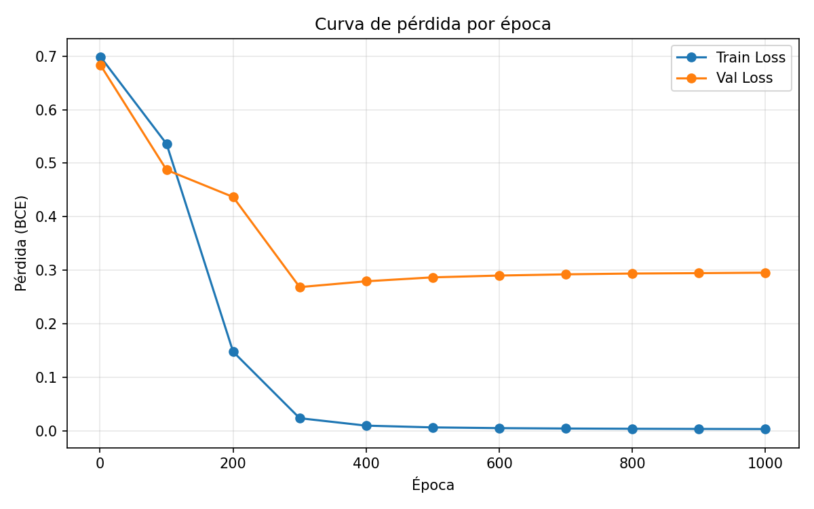
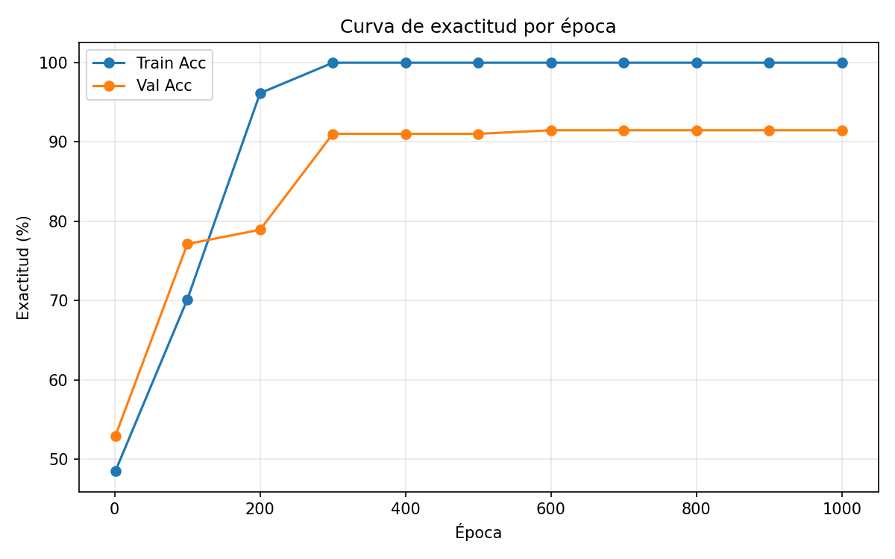

### Matriz de Confusión

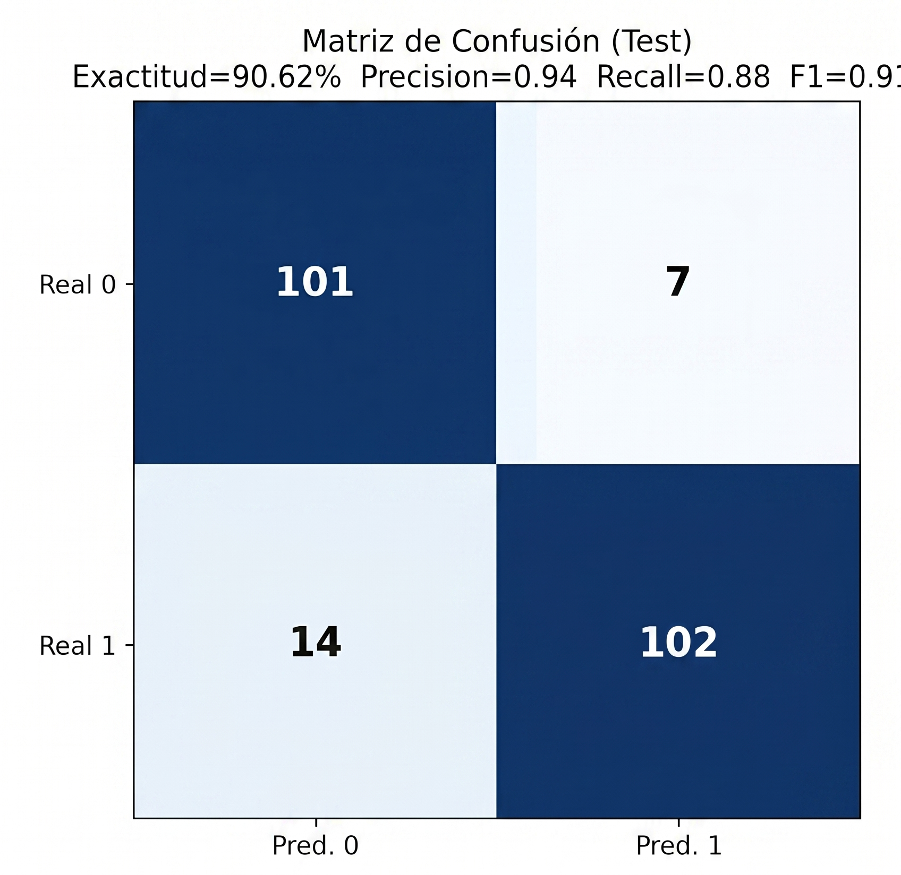

### Precisión, Recall y Puntaje F1

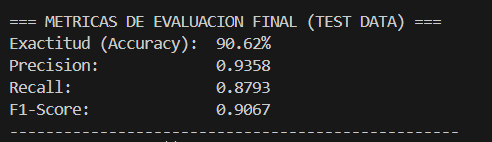

## Streamlit - Etapa 3

En esta sección se muestra el funcionamiento de la interfaz de usuario en Streamlit utilizando los pesos entrenados en CUDA para clasificar la postura.

### Predicción Correcta
En este caso, el clasificador detecta adecuadamente el estado de la postura:

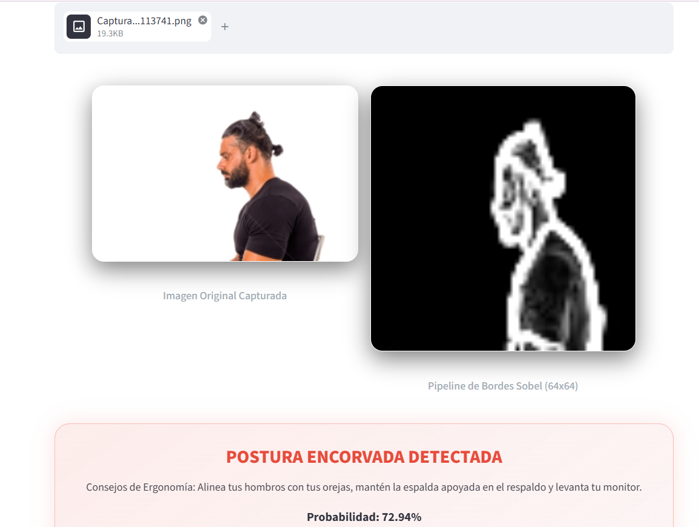

### Predicción Incorrecta (Fallo)
Aquí se muestra un caso de error en la inferencia:

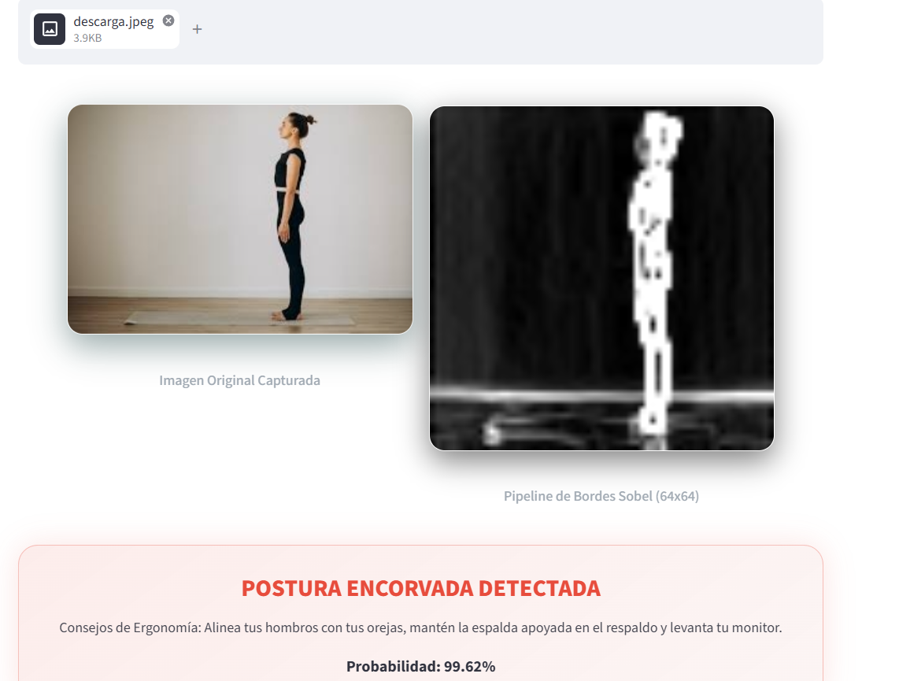

* **¿Por qué falló?**
El dataset con e que fue entrenado la res neuronal carece de imagenes de personas con cuerpo completo, mayormente tiene imagenes de la cintura hacia arriba, por lo tanto, la red neuronal no puede identificar correctamente la postura del cuerpo.
## Conclusiones

## Referencias

Enlaces a la documentación oficial consultada (NVIDIA CUDA C Programming Guide, especificaciones de OpenMP y librerías utilizadas).
